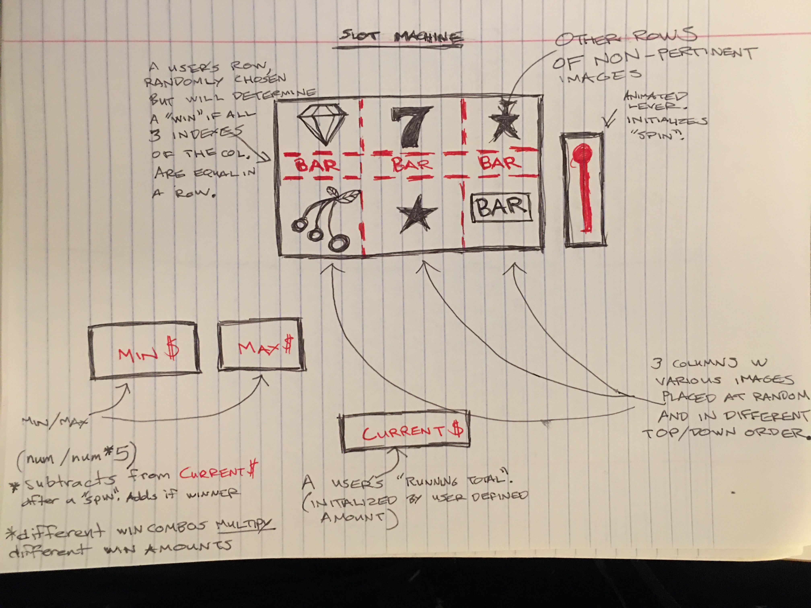
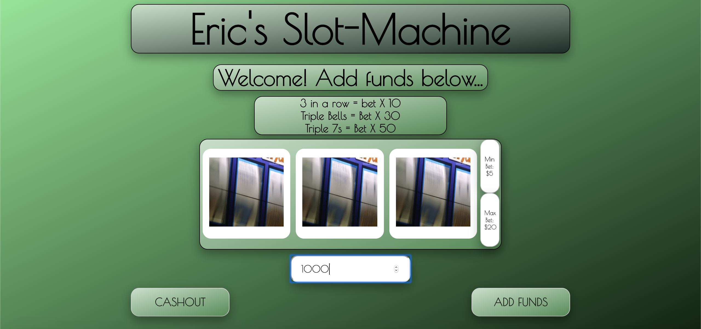
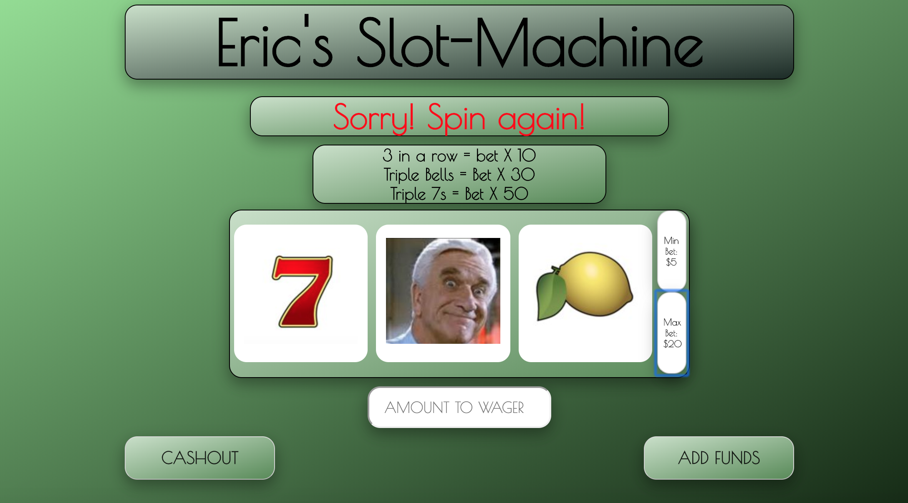
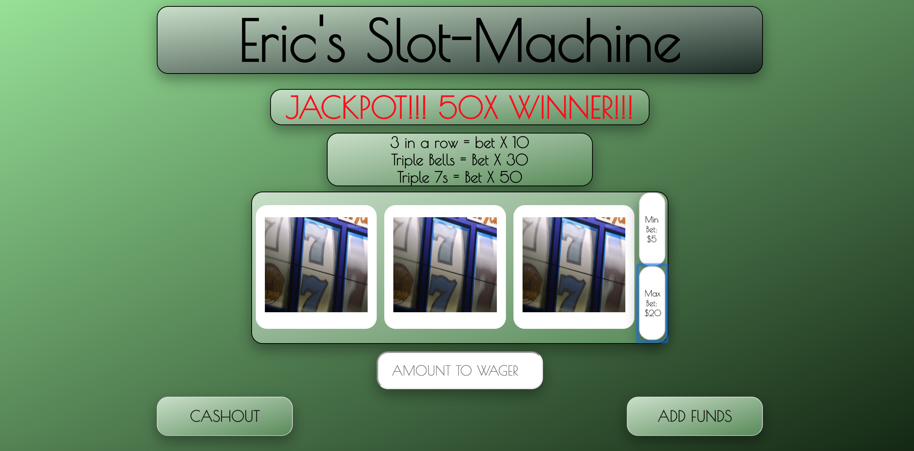

# Eric's Slot-Machine

## The Game
Inspired by novelty gambling machines meant to pass the time in New York bars in the late 1800s, **SLOTS** is a fun and addictive game that requires no skill but demands your attention. If you haven't played the slots, or it's been awhile, allow me paraphrase: a player places a wager and pulls a lever or pushes a button and a series of spinning wheels (typically 3) will spin vertically. As the wheel stops, a random pattern will emerge. If the middle row align a series of identical images, the player will win. Some series appear more or less frequently by design, and will multiply a player's winning return at corresponding ratios. The rarest and highest pay out? **JACKPOT!**
#### (For more on Slots, visit the Wikipedia link below)
[Wikipedia Link](https://en.wikipedia.org/wiki/Slot_machine#History)

## How it will play onscreen
A player will have an inviting welcome screen, displaying the resting image of a slot machine screen and a brief description of what a win or "jackpot" would look like. State will be initialized to null in terms of player's money but the winning combos and their corresponding multipliers will be constant in state. Player will input his amount to be wagered and this be will be continually updated with each click of spin, subtracting the individual wager. It will **ALWAYS SUBTRACT**, adding will happen conditionally. This will be rendered onscreen after each "spin". Animation of randomly generated rows of images will display but stop in rows after a short time, spinning message will alert a player that there's no going back now, the slots are in motion!

Also included is a mobile-friendly version, with action buttons aligned for a right handed phone user.

## Wireframe

## Welcome Screen

## Loss

## JACKPOT!

## Wins
IF player hits on a winning combo, his running total of avail money to be gambled will increase. To heighten user experience, screen will have various screen animations to be triggered with various intensity depending on how big the win. Cashout button will serve as a **RESET**, clearing the state and starting over.

## Technology Used

1. Javascript
2. HTML
3. CSS

## Future Development
For now, the game will simply have the middle of the three rows be the determining win row, but futute updates could include three rows and diagonals for additional wagers to increase the likeleyhood of a win. I'd like to incorporate a "bonus spin" feature as well, to reward players for a certain amount of time of money spent playing. Better animations, various payment options, sharing acheivements(wins) on social media may also be developed in the future. 

In the future I would also like to include brighter, more satisfying "win displays". Win sounds and fullscreen flashing messages maight be jarring to a user, but could be done tastefully as well to encourage time spent on app. Ethically though, this game should not be designed to addict a user, so i'd also like to set auto-reminders such as "it has been 15 minutes, would you like to take break?" or "please gamble responsibly".

## Pseudocode
Using 'lookupPics' as an array numbered 1-7, i will be able to index the avail slot-machine photos from our IMAGES object. A few audio files will be played at various times, with goAudio on a loop to simulate the slots "rolling". 

The object "state" will hold our user's data: money will be all avail funds to wager, subtracted by amount of of user's choice of spin. Variables bet and betMax will used as the number taken from "money" to at each "spin" and multiplied by a potential win, and added BACK into user's "money".

Object "slot123", is initialized to empty values. Used to hold the state of any given "spin" as to be compared for a "win". A few HTML elements added to manipulate the DOM, event listeners for clicks, jackpot and bell for incremental totals(if either = 3, bet or betMax yield different win results), and we're on to the functions.

Function init will begin the game, also triggered if a user "cashes out" (resets). Prompts the user to enter funds in my h2 message bar and wipes any data from previous rounds. Nothing can happen until user deposit funds.

Functions render and renderMax effectively the same thing, aware they are similar, but each plays the game the same and calls other functions, just with higher stakes. Functions spin and spinMax act as withdrawal functions, removing funds from user and call the preSpin function. 

The preSpin function is where the two games (bet and betMax) converge and begin playing the same game. nan is just a function to eliminate a user funds being returned as not a number and becoming $0.00. soundOn will simply turn on at each spin, but will call soundOff in 3.2 seconds which turns off the loop at roughly the same time it takes to complete a slot display spin. The preSpinDisplay will just set each visual "slot" to a gif of slots spinning to simulate an actual tactile machine being played. Finally the renderSlots begins calling the functions that begins changing the actual game data.

Function renderSlots is a for loop designed to heighten a user's suspense of a "wait and see" style game, (we can obviously quickly show the results) but it calls handleTime at increasing seconds for each slot, left to right. At this point, we're holding off our functions that checks for wins and renders each image based off handleTime's index and time. renderRandomImage will pull a random slot image from our avail images and assign it to our display as well as providing to our state by calling randomizeImg, pulling a random number by getRandomIdx to be returned as a key of IMAGES. (This function will also incrementally add to either our jackpot or bells bonuses for each slot).

Function getDollars will transfer user input to the state, calling our NaN function to check against any $0 amount to be displayed correctly, and provides a reassuring sound of money that confirms money has been added. The renderCurrentDollars will simply display a user's money data onscreen.

Moving on to our win/loss functions, checkForWin is called in handleTime on a timer of 3.5 secs so as to give slot images time to display. After the alotted time, checkForWin will be and "if else" check, "if" being a win situation(triggering checkForJackpot which checks for jackpot, bells, or a standard win. 3 different win outcomes), and the "else" being a loss calling renderLoss.

Trying to heighten a user's satisfaction of a win, a winDisplay function is called to change the slot to a cash machine dispensing money, and our old trusty message h2 will be another alert to a win.

## Don't forget to "give it a spin" below...
[Eric's Slot-Machine](https://ericjames3681.github.io/slot-machine/)

